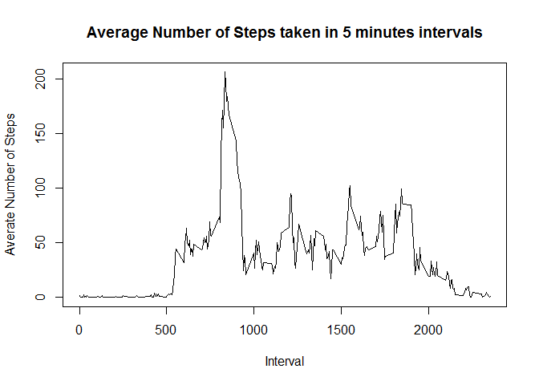

# Course 5: Reproducible Research: Week-1 Assessment-1


```r
library(dplyr)
library(lattice)
```

## Loading and preprocessing the data

```r
actMon <- read.csv("activity.csv")

actMon_by_Days <- group_by(actMon, date) %>% summarize(Total.Steps = sum(steps, na.rm = TRUE))

actMon_by_Intervals <- group_by(actMon, interval) %>% summarize(Avg.Steps = mean(steps, na.rm = TRUE))
```

## What is mean total number of steps taken per day?

```r
hist(actMon_by_Days$Total.Steps,
     breaks = 25,
     col = "light blue",
     xlab = "Steps",
     freq = TRUE,
     main = "Total Number of Steps taken per day")
```

\

```r
summary(actMon_by_Days)[3:4,2]
```

```
##                                     
## "Median :10395  " "Mean   : 9354  "
```


## What is the average daily activity pattern?

```r
plot(actMon_by_Intervals$interval, actMon_by_Intervals$Avg.Steps,
     type = "l",
     main = "Average Number of Steps taken in 5 minutes intervals",
     xlab = "Interval",
     ylab = "Averate Number of Steps")
```

\

The 5-minute interval, on average across all the days in the dataset, which contains the maximum number of steps is:
835

In-line code used

```r
actMon_by_Intervals$interval[actMon_by_Intervals$Avg.Steps == max(actMon_by_Intervals$Avg.Steps)]
```


## Imputing missing values

The total number of missing values in the dataset is
2304

In-line code used

```r
table(is.na(actMon$steps))[2]
```

The missing values in the dataset will be filled with mean value of all the steps per interval per day. Using the updated dataset the mean and median of the total number of steps taken per day is shown below:

```r
actMon_updated <- mutate(actMon, Date = as.Date(as.character(date), "%Y-%m-%d"))

actMon_updated$steps[is.na(actMon$steps)] <- mean(actMon$steps, na.rm = TRUE)

actMonUpdate_by_Days <- group_by(actMon_updated, date) %>% summarize(Total.Steps = sum(steps))

summary(actMonUpdate_by_Days)[3:4,2]
```

```
##                                     
## "Median :10766  " "Mean   :10766  "
```


## Are there differences in activity patterns between weekdays and weekends?

```r
weekEnd <- c("Saturday", "Sunday")

actMon_updated <- mutate(actMon_updated, week.day = weekdays(Date)) %>%
     mutate(day.of.week = ifelse(week.day == weekEnd, yes = "weekend", no = "weekday"))

actMon_updated_by_weekday <- group_by(actMon_updated, interval, day.of.week) %>%
     summarize(Avg.Weekday.Steps = mean(steps, na.rm = TRUE))

xyplot(actMon_updated_by_weekday$Avg.Weekday.Steps
       ~actMon_updated_by_weekday$interval
       |actMon_updated_by_weekday$day.of.week,
       type = "l",
       main = "Average Number of Steps taken in 5 minutes intervals by weekdays",
       xlab = "Interval",
       ylab = "Averate Number of Steps",
       layout = c(1,2))
```

\
